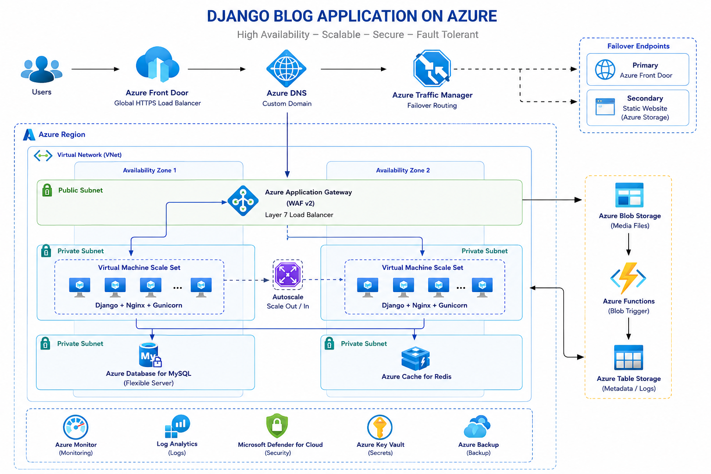
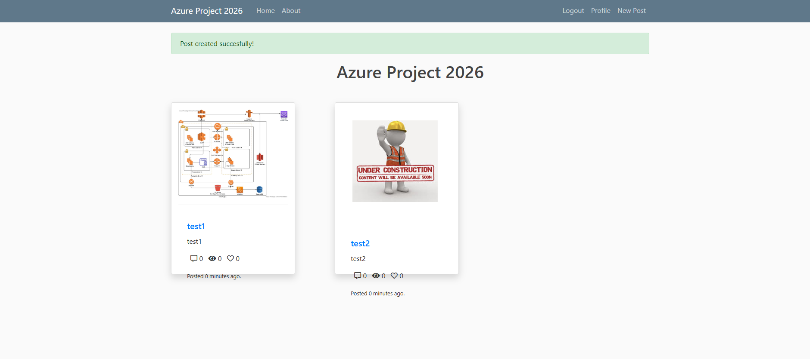

# Azure Capstone Project – Cloud-Native Django Blog Platform

## Project Overview

This project demonstrates the deployment of a production-style Django Blog application on Microsoft Azure using scalable, highly available, and cloud-native infrastructure services. The architecture was designed to simulate a real-world DevOps environment with autoscaling, load balancing, private networking, media storage, DNS routing, failover mechanisms, and serverless event-driven processing.

The application allows users to create blog posts, upload images and media files, authenticate users, and store application data in a managed MySQL database. Uploaded media files are stored in Azure Blob Storage, while Azure Functions automatically process Blob Storage events and log metadata into Azure Table Storage.

The entire infrastructure was configured and managed using Azure Portal services, Linux VM automation, networking configurations, and cloud-native Azure components.

---

# Architecture Components

## 1. Azure Virtual Network (VNet)

A dedicated Azure Virtual Network was created to isolate the application environment and provide secure communication between all Azure resources.

The architecture includes:

- Public Subnets
- Private Subnets
- Custom Route Tables
- Network Security Groups (NSGs)

The public subnet hosts frontend components such as the Azure Application Gateway, while backend application servers and databases remain isolated inside private subnets.

---

## 2. Azure VM Scale Sets (VMSS)

The backend Django application servers were deployed using Azure Virtual Machine Scale Sets (VMSS).

Features implemented:

- Multiple backend Ubuntu Linux instances
- Autoscaling architecture
- High availability
- Health probe integration
- Automatic instance provisioning
- Shared application deployment process

Each VM instance automatically installs:

- Python
- Django dependencies
- Gunicorn
- Nginx
- Application source code from GitHub

using automated startup scripts (cloud-init / custom script extension).

---

## 3. Azure Application Gateway

Azure Application Gateway was configured as a Layer 7 Load Balancer for frontend traffic management.

Responsibilities:

- HTTP traffic routing
- Backend health checks
- Reverse proxy functionality
- Traffic distribution across VMSS instances
- High availability frontend entry point

The Application Gateway forwards client traffic to healthy backend VM instances running the Django application.

---

## 4. Azure Database for MySQL

A managed Azure Database for MySQL instance was deployed to store:

- User accounts
- Blog posts
- Authentication data
- Application metadata

Security design:

- Database located inside private networking
- Accessible only from backend application servers
- Protected using NSG rules and subnet isolation

---

## 5. Azure Blob Storage

Azure Blob Storage was integrated for media management.

Uploaded files such as:

- Profile pictures
- Blog images
- Media assets

are automatically stored inside Blob Storage containers instead of local VM disks.

Benefits:

- Persistent storage
- Shared media access across all VM instances
- Scalability
- High durability
- Cloud-native storage architecture

---

## 6. Azure Static Website Hosting

Azure Storage Static Website Hosting was configured to provide a failover maintenance page.

Purpose:

- Display maintenance page during backend outages
- Disaster recovery simulation
- Secondary fallback architecture

---

## 7. Azure DNS

Azure DNS was configured for custom domain management.

The project domain was mapped to Azure frontend services, enabling browser-based access using custom URLs.

---

## 8. Azure Traffic Manager

Azure Traffic Manager was configured to simulate failover routing behavior.

Traffic flow:

Primary:
- Azure Application Gateway

Secondary:
- Azure Static Website

Features:

- DNS-based traffic routing
- Endpoint monitoring
- Failover testing
- High availability architecture concepts

---

## 9. Azure Functions (Blob Trigger)

An Azure Function with Blob Trigger integration was created to process uploaded media files automatically.

Workflow:

1. User uploads image to Django application
2. File stored inside Azure Blob Storage
3. Blob Trigger detects upload event
4. Azure Function executes automatically
5. Metadata written into Azure Table Storage

This demonstrates event-driven serverless processing in Azure.

---

## 10. Azure Table Storage

Azure Table Storage was used to store metadata generated by Azure Functions.

Stored information includes:

- Blob name
- Blob path
- Upload event details
- File size
- Timestamp

This component demonstrates lightweight NoSQL storage integration.

---

# Security Configuration

The project includes multiple cloud security concepts:

- Network Security Groups (NSGs)
- Private subnet isolation
- Reverse proxy architecture
- Controlled backend access
- Database isolation
- Application Gateway frontend protection

Only required ports and services were exposed publicly.

---
## Expected Outcome

# Linux & DevOps Automation

The deployment process included Linux administration and DevOps practices such as:

- Nginx configuration
- Gunicorn service management
- Python virtual environments
- Automated VM bootstrap scripts
- GitHub repository deployment
- Environment variable management
- Django production configuration

---

# Technologies Used

## Cloud Platform
- Microsoft Azure

## Backend
- Python
- Django
- Gunicorn
- Nginx

## Infrastructure
- Azure VM Scale Sets
- Azure Application Gateway
- Azure VNet
- Azure DNS
- Azure Traffic Manager

## Storage
- Azure Blob Storage
- Azure Table Storage

## Database
- Azure Database for MySQL

## Serverless
- Azure Functions
- Blob Trigger

## Operating System
- Ubuntu Linux

---

# DevOps & Cloud Concepts Demonstrated

- Cloud networking
- High availability architecture
- Autoscaling
- Reverse proxy configuration
- Load balancing
- Blob Storage integration
- Serverless event processing
- DNS routing
- Failover scenarios
- Infrastructure automation
- Linux administration
- Production-style Django deployment

---

# Project Outcome

At the end of the project:

- A scalable Django Blog platform was successfully deployed on Azure
- Media uploads were integrated with Blob Storage
- Multiple backend instances served traffic behind Application Gateway
- Azure Functions processed storage events automatically
- Traffic Manager simulated high-availability failover behavior
- Azure DNS enabled custom domain access
- Production-style cloud architecture concepts were implemented successfully

---

# Author

Aydin Tokuslu  
Cloud & DevOps Engineer  
Germany
